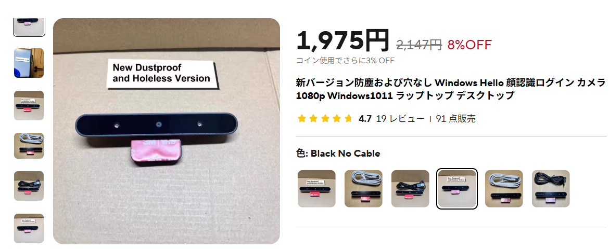
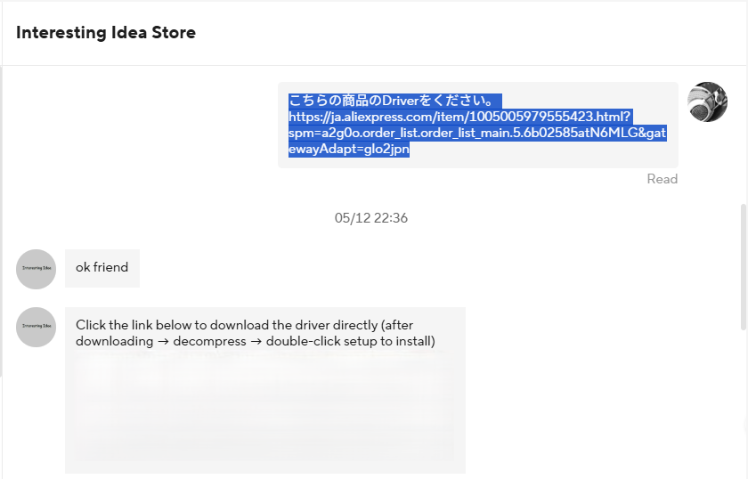

---
tags:
  - "#PCパーツ"
  - "#aliexpress-review"
  - "#webcam-review"
  - "#pc-accessories"
  - 購入レビュー
  - 海外通販
  - Webカメラ
  - WindowsHello
---
### はじめに
Windows Helloの顔認証は一度使うと手放せない便利な機能だが、対応するWebカメラはまだ選択肢が少なく、高価なものが多いのが現状である。
今回は、Aliexpressで驚くほど安価なWindows Hello対応を謳うWebカメラを見つけたので、実際に購入し、その実力を試してみた。

購入した商品はこちら。
https://www.aliexpress.com/item/1005005979555423.html?spm=a2g0o.order_list.order_list_main.5.61f0585aWRf5MG

カラーはモニター上部に設置しても目立ちにくいブラックを選択。ケーブルは手持ちのUSB Type-Cケーブルを使用するため、ケーブルなしのモデルを選んだ。

### 製品の主な仕様

*   **商品名**: 新バージョン 防塵・穴なし Windows Hello 顔認証ログインカメラ
*   **種類**: Webカメラ
    *   (商品ページではなぜか「空気清浄機部品」と記載されている・・・)
*   **製造国**: 中国
*   **解像度**: 1920 x 1080
*   **インターフェース**: USB Type-C
*   **接続方法**: カメラ背面のType-Cポートに、付属のType-A to Type-Cデータケーブルを接続 (USB3.0ポートの使用を推奨)
*   **固定方法**: 両面テープでモニター上部/下部に貼り付け、または机上に直接設置して角度調整可能
*   **付属データケーブル**: Type-C データケーブル (2m)
*   **互換性**: Windows 10搭載のデスクトップPCまたはノートPC (Windows 11でも動作報告あり)
*   **ドライバー**: HPの公式ドライバーをインストール (入手方法は販売者に要問い合わせ)
*   **ハードウェア状態**: 使用モジュールはすべて新品

### 開封と外観チェック
届いた製品の外観は以下の通りである。

-   **サイズ感**: 想像していた通りのコンパクトさである。
-   **デザイン**: この製品を選んだ最大の理由は、類似品にありがちな本体正面のメーカーロゴや余計な文字がなく、非常にすっきりしている点である。ミニマルなデザインは主張しすぎず、どんなモニターにも馴染みやすいだろう。
        
-   **質感**: 価格相応で、高級感はないが、実用上は問題ないだろう。
-   **機能性**:
    -   粘着シートでモニターに固定できる、無段階調整可能な首振り機構が搭載されており、カメラの角度調整は非常に柔軟に行える。
    -   接続ポートはUSB Type-Cで、本体背面に配置されている。

（ここに届いた本体の写真を数枚挿入すると、より分かりやすくなる）

### セットアップとドライバーインストール
PCに接続しただけでは、残念ながらすぐには動作しなかった。
ドライバーが必要なようである。商品説明ページやウェブ検索で探すこともできるが、最も確実なのは販売元に直接問い合わせることである。

Aliexpressの注文履歴から販売者に以下のように連絡した。
（日本語で「Windows Helloカメラのドライバーを送ってください」といった内容で問題なく通じた）

すると、すぐにドライバーのダウンロードURLが送られてきた。
ドライバーをインストールし、PCを再起動したところ、デバイスマネージャーでカメラが問題なく認識されていることを確認できた。

### Webカメラとしての画質
念のため、通常のWebカメラとしての画質も確認してみた。
正直なところ、画質は「可もなく不可もなく」といったレベルで、特筆すべき点はない。一般的なビデオ会議などには使えると思うが、高画質を期待する製品ではないだろう。
今回はWindows Helloの顔認証機能が主目的であり、Webカメラとして使用する予定はないため、この点は問題視していない。

### Windows Hello 顔認証機能の検証

#### Windows Hello対応カメラに必要なもの
Windows Helloの顔認証機能を利用するためには、通常のWebカメラとは異なり、**赤外線(IR)カメラ**と**赤外線照射装置**が搭載されている必要がある。
-   **理由**: 通常の可視光カメラでは、写真や動画などを使って他人になりすますことが比較的容易である。一方、赤外線カメラは顔の深度情報（凹凸）を捉え、より立体的に個人を識別するため、セキュリティが向上する。

#### 顔認識時の動作
このカメラも、顔認証を行う際には**赤外線LEDが赤く点滅**する。これは赤外線カメラがアクティブになり、顔をスキャンしていることを示すものである。

#### Windows 11での設定と動作確認
Windows 11の設定メニューから「アカウント」>「サインインオプション」>「顔認識 (Windows Hello)」を選択し、画面の指示に従って顔を登録する。
登録後、実際にロック画面で顔認証を試したところ、スムーズに認識され、デスクトップへログインできることを確認した。

#### Windows Helloの利便性と活用シーン
Windows Helloの顔認証がなぜ便利なのか、具体的な利用シーンを交えて解説する。

-   **圧倒的なログイン速度**:
    -   PCの起動時やスリープからの復帰時に、パスワードやPINコードを入力する手間が一切不要になる。カメラに顔を向けるだけで、ほぼ一瞬でログインが完了する。
-   **セキュリティと利便性の両立**:
    -   複雑なパスワードを設定しても、入力が面倒でつい簡単なものにしがちだが、顔認証ならその心配がない。高度なセキュリティを保ちつつ、手間なく利用できる。
-   **ハンズフリー操作**:
    -   手が離せない作業中や、キーボードに触れたくない時（例えば食事中など）でも、顔を向けるだけでPCのロックを解除できる。
-   **複数ユーザーでの利用**:
    -   家族で一台のPCを共有している場合、それぞれの顔を登録しておけば、使用するユーザーを自動で認識し、個別の環境にログインできる。
-   **対応アプリケーションでの活用**:
    -   一部のアプリケーションやウェブサイトでは、Windows Helloによる認証をサポートしており、パスワード入力の代わりに顔認証でログインできる場合がある。

### まとめ
Aliexpressで購入したこの激安Webカメラは、Webカメラとしての画質は平凡だが、主目的であったWindows Helloの顔認証機能については問題なく動作した。
ドライバーの入手には一手間必要だったが、販売元のサポートも迅速で、無事にセットアップできた。

主なメリット・デメリットは以下の通りである。
-   **メリット**:
    -   Windows Hello対応カメラとしては非常に安価。
    -   ロゴなしのミニマルなデザイン。
    -   顔認証の速度や精度は実用レベル。
-   **デメリット**:
    -   Webカメラとしての画質は期待できない。
    -   ドライバーの入手がやや特殊（販売元への連絡が必要）。
    -   質感は価格相応。

Windows Helloの快適さを手軽に体験したい方にとって、この製品は魅力的な選択肢の一つになるのではないだろうか。特に、デザインにこだわりがあり、シンプルな外観を求める方にはおすすめである。